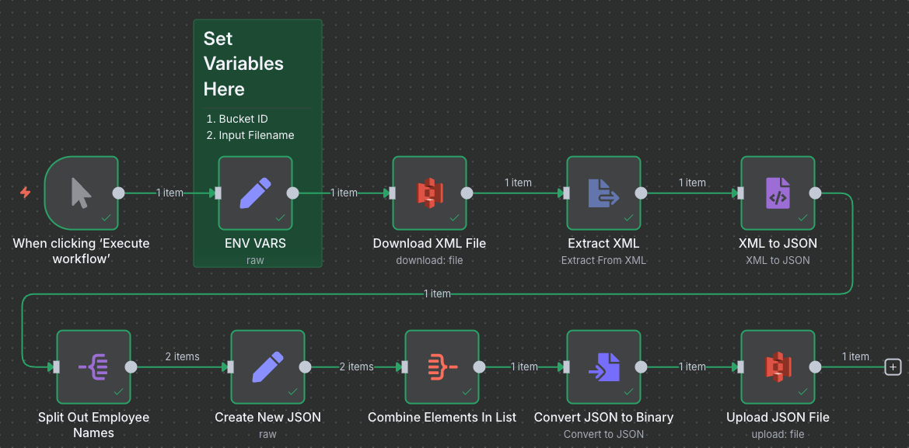

# Convert AWS S3 XML file to JSON

An n8n workflow to download an XML file from an AWS S3 buckets, collect specific elements from it, convert it to JSON and upload back to AWS S3.

## Getting Started

### About This Code

A Proof-of-Concept n8n workflow created for Upwork Job ID 1945538841191108591  You're welcome to use it however you'd like.

### Requirements

* An [n8n.io](n8n.io) account (or self-hosted)
* An AWS account (or access to an S3 bucket by some other means)

### Instructions For Use

* Download xml_to_json_automation.json and import it into your n8n workspace.
* Follow the instructions in the Sticky notes.  You will need to set your Amazon credentials in the AWS S3 Nodes.

### Optional

## Authors
* **Aaron Melton** - *Author* - Aaron Melton <aaron@ascendautomation.ai>
